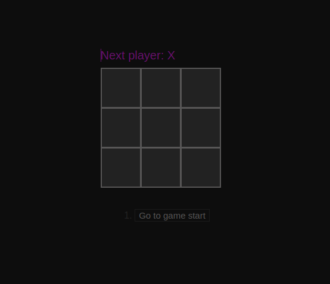
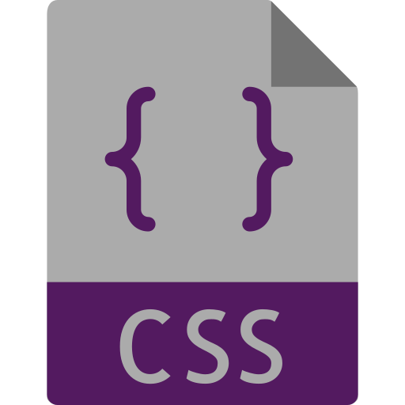

<h1>Tic Tac Toe</h1>  

  

  
This is a simple and pretty cute Tic Tac Toe game.

  
I made it using HTML, CSS and Javascript.

  
  
You can check the page, and see it working <a href="https://yasminconstantino.github.io/tic-tac-toe/">here</a>

  <h4> Languages and Technologies:</h4>
  

    
    
    
  

 

 
<section>
  

    
Clique aqui para ler em português

     
    
Esse é um jogo da velha simples e fofo.

     
    
Eu fiz ele usando HTML, CSS e Javascript.

    
Você pode acessar a página e ver ela funcionando <a href="https://yasminconstantino.github.io/tic-tac-toe/">aqui</a>

    <h4>Linguagens e tecnologias utilizadas:</h4>
    

    
    
    
    

  

</section>